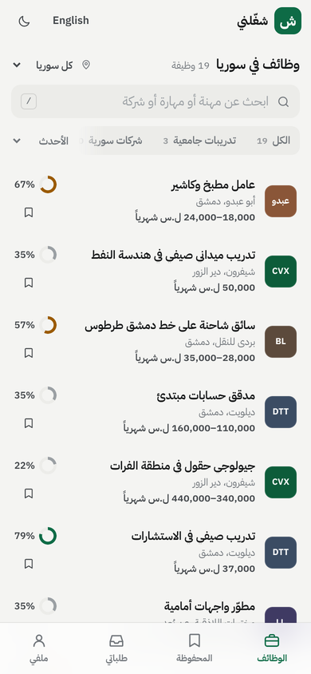
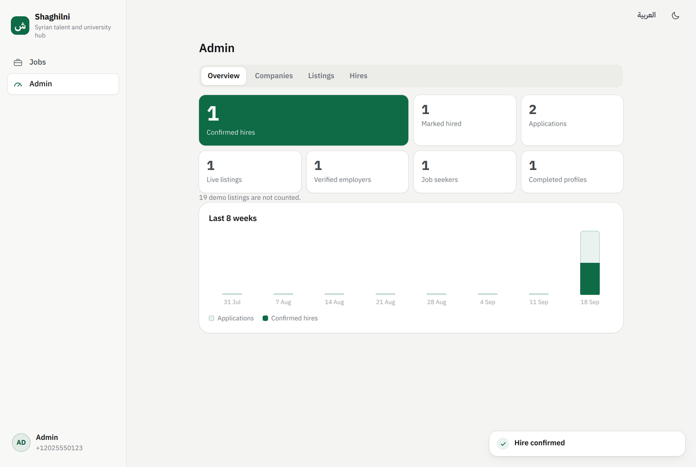

# Shaghilni · شغّلني

Verified jobs and internships in Syria. This is the MVP web app: Arabic first with full English, built for phones on slow connections, with a small Node.js server that has **no npm dependencies**.



## What it does

**Job seekers** sign in with their mobile number and a texted code, build a bilingual profile in a few steps, and then see every listing with a fit score and the reasons behind it. Anyone with a resume already can upload it (a PDF, Word or plain-text file, in Arabic or English) to fill in their profile: the file is read on the phone and never uploaded, and nothing already in the profile is replaced. They save jobs, apply in one tap or by WhatsApp, and follow each application from *Sent* to *Hired*. They get a text message when an employer shortlists them, invites them to interview, hires them or turns them down. A resume helper builds one resume from the profile, in Arabic or English, ready to print, save as PDF or send. *Tailor my resume for this job* opens that same resume focused on a job: the checks compare it with what the job asks for, and any change applies to the one resume (there are never separate versions).

**Recruiters.** Every job seeker has a **Recruiters** tab. If they switch on *Let recruiters find me*, verified employers can find them by stage (students or graduates), experience, faculty, university, governorate, year of study or skill, limit the list to verified students, and invite them to apply for a job or to an event such as a careers day. Employers see only a short card: first name and last initial, education, governorate, experience level, recent job titles, skills, languages and the verified-student badge. The phone number is shared only when the person applies, or says yes to an event. Anyone can say no, or block a company (in the full app; Lite offers yes or no), and nobody is listed unless they switch it on. Recruiters sign up at **/hire**.

**Shaghilni Lite** (at **/lite**) is for phones on slow or expensive data. It has a matching look (the logo, tab bar and company tiles, with colours close to the full app's, set separately in `server/lite-assets.js`), but its pages are rendered on the server, with no web fonts and no images. One small stylesheet and one icon file (about 3 KB together) are downloaded once and cached for good, so the first visit is under 15 KB and each page after that is about 1–3 KB (the test allows up to 3 KB). Browsing, applying and editing a profile need no JavaScript, and the privacy notice and terms are there too (`/lite/privacy`, `/lite/terms`). Two small cached scripts are optional: the invisible sign-in check (signing in needs it whenever `OTP_POW_BITS` is above 0, the default) and a one-line script that turns *Save as PDF* into a button on the resume page. Job seekers get five tabs: **Jobs** (search, type chips, governorate, fit score and saving), **Applied**, **Recruiters** (the switch and invitations), **Resume** (in English or Arabic, with translation progress, *Send as text on WhatsApp* and *Save as PDF*) and **Profile** (a completeness meter and editing in five short steps, including adding, editing and deleting jobs). Recruiters sign up at /hire, add their company details, and once verified search candidates, invite them and follow their invitations. Team invitations and the team page are not in Lite: someone invited to a company accepts in the full app. The full app shows a *Slow connection? Shaghilni Lite* link while it loads, and keeps it on 2G or data-saver connections.

**Employers** create a company page and submit it for verification. Listings must show pay and the governorate where the work happens (with a title, a summary and the working language); a listing that asks candidates for money is blocked (any fee word in its text, and in any box a demand whose payer is the candidate, with a modal or a sum, such as "candidates must pay", "the trainee pays 100,000 SYP", "deposit required" or «على المتقدمين دفع», unless negated), and gendered wording, contact details (a phone number or an email anywhere in the text, place and tags included) and other payment wording in any box (a fee word, a payment word near a person, «دفع», «تسديد», «رسوم», «قسط», and any sum of money written with its currency or in thousands: "tuition fees covered", «دفع رسوم النقابة على حساب الشركة») are flagged for review; the admin approves a fee-flagged listing only after ticking that they read the flagged wording and it asks candidates for no money (recorded in the audit log). The word lists are fixed lists: refusal is kept narrow (a demand negated in its own clause is flagged, not refused) so that stating a trainee's pay, a benefit or an anti-scam notice outside the listing's own text is not refused (in its own text any fee word is still refused, as before Stage 4), and the flag is kept wide; `test/fee-corpus.test.js` pins both sides on 456 realistic lines. Every listing is reviewed before it goes live, and any edit, to a live listing or to one that awaits review or is closed, makes it a draft that must be reviewed again before it is on the board. Applicants arrive in a pipeline (new, shortlisted, interview, hired or rejected) with their resume, a call button, a WhatsApp button and a private note. A hire recorded by mistake can be moved back to interview until the Shaghilni team confirms it; a confirmed hire is final. Changing the company's name or registration number sends the page back for verification: until the Shaghilni team verifies it again, as after a rejection or a suspension, its listings leave the board and its team reads no applicant and moves nobody.

**You, the admins**, verify companies (including the US sanctions-list check), review listings, and confirm hires by phone. The dashboard leads with **confirmed hires**, the one metric that matters, and shows the last 12 weeks of new users, new jobs, applications and confirmed hires.



## Quick start

You need **Node.js 22.13 or newer** (Node 22 LTS or 24). Earlier Node 22 releases hide the built-in database behind a flag. There is nothing to install.

```bash
OTP_DEV_ECHO=true ADMIN_PHONES=+963944000000 npm start
```

Open http://localhost:3000. Put your own number in `ADMIN_PHONES`.

In development, text messages are printed in the terminal instead of being sent, and `OTP_DEV_ECHO=true` also shows the sign-in code on screen. The first run adds 68 demo listings from 32 demo companies so the board isn't empty (one of the 69 sample listings has no pay and fails the same posting checks a real listing must pass). Each demo listing says it's a demo, and the Overview dashboard leaves them, and applications to them, out of its numbers. They are never added in production.

To keep settings in a file instead, copy `.env.example` to `.env` and edit it. The server reads it on start.

## Five-minute walkthrough

1. **Job seeker (use a phone-sized window).** Pick *I'm a university student*, enter any Syrian mobile number such as `0944 111 222`, tick the consent box, type the code shown on screen, and fill in the profile. Open a listing and tap *Quick apply*: the resume is already attached, so pick *العربية* or *English* and send it. Then check *Applications*.
2. **Employer (second browser or a private window).** Tap *Post a job*, sign in with a different number, add your company and submit it for verification. Create a listing: type the word "fee" into the description and watch the check turn red. Remove it and save the draft. Submitting now is refused, because the company isn't verified yet.
3. **Admin (third browser).** Sign in with the number in `ADMIN_PHONES`. Under *Companies*, tick the sanctions-screening box and verify the company. Back as the employer, submit the listing; as admin, publish it under *Listings*.
4. **The loop.** As the job seeker, apply to the new listing by WhatsApp. As the employer, open *Applicants*, view the resume and move the applicant to *Shortlisted*, *Interview* and *Hired*. The terminal shows the text message sent at each step. As admin, confirm the hire under *Hires*. The *Confirmed hires* number goes to 1.

## Configuration

Set these as environment variables or in `.env`.

| Setting | Default | What it does |
|---|---|---|
| `NODE_ENV` | `development` | Set to `production` when live. Turns on secure cookies, strict HTTPS and production checks. |
| `PORT` / `HOST` | `3000` / `0.0.0.0` | Where the server listens. |
| `BASE_URL` | none | **Required in production.** Your public address, exactly, starting with `https://`, for example `https://your-domain.example`. Used to reject requests from other sites. |
| `DB_PATH` | `data/shaghilni.db` | The database file. Put it on a persistent disk. |
| `ADMIN_PHONES` | none | Comma-separated numbers in international format (`+9639…,+1202…`). These accounts become admins when they sign in. A number taken off the list is demoted to an ordinary account at its next sign-in and its open sessions end. |
| `OTP_PEPPER` | dev value | **Required in production:** a random secret of at least 32 characters, mixed into stored sign-in codes. The server won't start without it. |
| `OTP_DEV_ECHO` | `false` | Development only: shows the sign-in code on screen. Ignored in production. |
| `SESSION_DAYS` | `30` | How long people stay signed in. |
| `OTP_POW_BITS` | `14` | Difficulty of the invisible sign-in challenge that slows down bots. Each +1 doubles the work; `0` turns it off; the highest is 24. |
| `SMS_PROVIDER` | `console` | `console` (print to log), `textbee` or `twilio`. |
| `TEXTBEE_API_KEY` | none | For `textbee`. |
| `TWILIO_ACCOUNT_SID`, `TWILIO_AUTH_TOKEN`, `TWILIO_FROM` | none | For `twilio`. |
| `SMS_ALLOWED_PREFIXES` | Syria and the main diaspora countries | Country codes that texts may go to. Admin numbers are always allowed. Keeping it narrow blocks SMS-pumping fraud. |
| `SMS_DAILY_CAP` | `1000` | Most texts the whole site sends in a day (UTC). Beyond it, sign-in pauses until midnight. |
| `ANTHROPIC_API_KEY` | none | Turns on Claude in the resume helper: wording suggestions and translation drafts. Without it, people can still write translations themselves. |
| `CLAUDE_MODEL` | `claude-sonnet-5` | The Claude model used for suggestions and translations. |
| `AI_DAILY_CAP` / `AI_USER_DAILY_CAP` | `300` / `30` | Most Claude calls (suggestions and translations) per day: for the whole site, and per person. |
| `SEED_DEMO` | `true` | Development only: add the sample listings on first start (added once; never again after `npm run demo:remove`). Ignored in production, where sample data is never added: the listings carry real organisations' names. |
| `TRUST_PROXY` | `false` | Set to `true` behind a hosting proxy (Render, Railway, Fly, nginx, Caddy). See *Deploying*. |
| `API_RATE_LIMIT` / `WRITE_RATE_LIMIT` | `600` / `240` | Requests per minute per address: all API calls, and changes. |
| `LEGAL_NAME` | none | Your registered company name, shown in the privacy notice and terms. |
| `CONTACT_EMAIL` | none | **Needed before launch.** The address for privacy requests and reports, shown in both documents. |

Generate a pepper with:

```bash
node -e "console.log(require('crypto').randomBytes(32).toString('hex'))"
```

## Text messages

Sign-in codes, application updates, event tickets, recruiter invitations, team invitations and job-alert digests go by SMS.

- **`textbee`**: an Android phone with a Syrian SIM runs the textbee app and sends the messages from your own number. It's the cheapest route inside Syria and replies come back to that phone. Set `SMS_PROVIDER=textbee` and `TEXTBEE_API_KEY` from the textbee dashboard.
- **`twilio`**: international and reliable, but far more expensive per message to Syria. The startup cost document compares the two.
- **`console`**: prints messages to the server log. For development only.

Job seekers get a text when an employer shortlists them, invites them to interview, hires them or turns them down, and when a recruiter invites them to a job or an event. Every message is stored first; failed sends show on the admin dashboard. Arabic texts use UCS-2 (70 characters fit one text, 67 each part of a longer one), so with a company name and a job title most Arabic notifications go as two parts and are billed as two; the sign-in code is one (U-005).

## Resume suggestions and translation (optional)

Names are never sent to Claude. When a resume is shown in the other language and the person hasn't typed their name in it, the name is written in that script on the device: common Syrian and Arab names get their usual spelling ("عمر نبيل الخطيب" becomes "Omar Nabil Al-Khatib"), others are spelled out, and the translation editor asks the person to check it against their passport or ID.

With `ANTHROPIC_API_KEY` set, the resume helper can suggest stronger wording for a job seeker's bullet points. The person opens a job and taps *Tailor my resume for this job*; the server accepts only bullet points already saved in that person's profile, allows 10 Claude requests an hour per person (suggestions and translations together), and runs every suggestion through the same fact guard the browser uses. Any suggestion that adds a number (in figures, or as a number word in English or Arabic, the Arabic duals such as «مليوني» and «سنتين» included), a capitalised name, a governorate or country (in Arabic too, «أمريكا» and «المملكة المتحدة» included), a word taken from the job advert that the profile doesn't contain, or a bigger role ("helped" made "led", "ساعدت" made "أدرت") is held back, as is one that grows well beyond the original. The word lists are fixed lists, and an Arabic employer or tool name the engine doesn't know still gets through, so the person reads every suggestion before tapping *Use*. Without a key, the helper explains that suggestions aren't switched on; everything else works.

**Resumes in both languages.** People can write their profile in Arabic, English or a mix, and the resume helper shows it in either language: switch the resume between *العربية* and *English*. Each line that isn't already in that language is shown in its saved translation. Anything still untranslated is counted in a notice above the resume, which opens an editor listing every line next to its translation.

- **Writing translations.** With no API key, people type the translations themselves. With `ANTHROPIC_API_KEY` set, *Translate with Claude* drafts the missing lines, in either direction, up to 60 lines (about 8,000 characters) a call (a note says when more remain), and people check and correct them in the same editor.
- **What Claude receives.** Only the resume's text, never the person's name or phone number. Names are typed by the person (*your name in English*, *your name in Arabic*).
- **The fact check.** A translation is dropped, and left for the person to write, if it changes, drops or invents a number, or if an English version still contains Arabic.
- **Applying.** Quick apply attaches the resume and asks which language to send. The default is English when the job asks for English; otherwise it's the language the resume is mostly written in. The panel counts any lines not yet translated, links straight to the editor, and shows a preview.
- **WhatsApp and employers.** WhatsApp applications send the resume in the message's language. Employers open each resume in the language it was sent in, labelled as such, and can still switch.
- **Storage.** Translations are saved with the profile. Each application keeps the version sent at that moment, so later translations don't reach employers who already have it.
- **Cost.** Each translation counts as one call against the same daily AI caps as suggestions.

## Deploying

Shaghilni runs as **one always-on Node process with a persistent disk** for the database file. That makes it simpler and cheaper than the Vercel and Supabase setup assumed in the cost document, but it can't run on serverless functions.

**Option A: Render or Railway.** Create a web service from the repository.

- Build command: none.
- Start command: `npm start`.
- Health check path: `/api/health`.

Add a persistent disk mounted at `/data`, then set these variables:

```
NODE_ENV=production
DB_PATH=/data/shaghilni.db
BASE_URL=https://your-domain
TRUST_PROXY=true
OTP_PEPPER=<random secret, 32+ characters>
ADMIN_PHONES=<your numbers>
SMS_PROVIDER=textbee
TEXTBEE_API_KEY=<key>
ANTHROPIC_API_KEY=<key, optional>
LEGAL_NAME=<your registered company>
CONTACT_EMAIL=<privacy@your-domain>
```

Sample data is never added in production: with `NODE_ENV=production` the sample listings are not seeded, whatever `SEED_DEMO` says. If a database that was first used in development still holds them, the server says so at start-up and the Insights screen shows a "Needs attention" note until `npm run demo:remove` has run.

**Option B: Docker on a small VPS.**

```bash
docker build -t shaghilni .
docker run -d --name shaghilni -p 127.0.0.1:3000:3000 -v shaghilni-data:/data --env-file .env shaghilni
```

Put Caddy or nginx in front for HTTPS (a two-line Caddyfile is enough: `your-domain { reverse_proxy 127.0.0.1:3000 }`) and set `TRUST_PROXY=true`. The `.env` you pass with `--env-file` must say `NODE_ENV=production`: it overrides the image's own setting, and the shipped `.env.example` says `development`. Run `npm run security:check` against that file first; it fails until the file says production.

Two settings matter more than they look:

- **`BASE_URL`** must match your public address exactly, including `https://`. Otherwise every form submission is refused as coming from another site.
- **`TRUST_PROXY=true`** is required behind a hosting proxy. Without it, every visitor appears to come from the proxy's address and shares one rate limit, so a busy morning could lock everyone out of sign-in. Leave it `false` when nothing sits in front of the server, or visitors could fake their address.

## Running it

**Backups.** `npm run backup` writes a consistent copy to `backups/shaghilni-YYYY-MM-DD-HH-MM.db` while the site keeps running; it stops with an error, and writes nothing, if `DB_PATH` names no database. Schedule it daily (for example with cron, which then reports the failure) and copy the files off the server. To restore, stop the app, replace the database file, delete any `-wal` and `-shm` files next to it, and start again.

**Demo listings.** `npm run demo:remove` deletes the demo companies and listings, including any applications made to them. They won't be added again.

**Before you go live:** the launch checklist, with who owns each item and how it is verified, is in [docs/LAUNCH.md](docs/LAUNCH.md).

## How it's built

```
server/          Node.js, no dependencies
  index.js       entry point: settings, database, sample data (development only), the app, hourly sweeps
  app.js         routes, sessions, CSRF defence, static files, /lite, /pay, /hire
  config.js      settings and .env loading; the production lockdown
  db.js          SQLite (node:sqlite) and migrations
  http.js        routing, JSON bodies, cookies, security headers, rate limits
  auth.js        phone sign-in codes, the sign-in challenge, consent and sessions
  guard.js       text destinations, daily text and AI caps, phone masking in logs
  retention.js   deletes data once it's no longer needed (at start-up and hourly)
  core.js        runs the browser's rule engine on the server
  validate.js    input sanitising and posting checks
  notify.js      text-message templates and sending: application updates, invitations, tickets, digests
  sms.js         console, textbee and Twilio senders
  alerts.js      job alerts and their digests
  plans.js       plans, seats, invitation caps and team roles
  payments.js    card payments: the test adapter, and the QNB adapter still to complete
  traffic.js     privacy-preserving visit counts and the System tab
  assets.js      bundles and gzips the client at start-up
  serialize.js   what each API answer contains
  lite.js        Shaghilni Lite pages (with its own small string table)
  lite-assets.js Lite's stylesheet and icons
  seed.js        the sample listings from seed/demo.json (development only, never in production)
  routes/        public, me, resume, recruit, employer, team, campus, events, admin, insights
seed/            demo.json: the 32 sample companies and 69 sample listings
public/          the interface: plain JavaScript, bundled and gzipped at start-up
  js/engine.js   matching, Arabic search, posting checks, resume builder and fact guard
  js/app*.js     views for job seekers, employers, career offices and admins
  js/i18n*.js    the app's interface strings in English and Arabic (Lite's are in server/lite.js, texts in server/notify.js)
  js/legal.js    the privacy notice and terms of use (drafts: see SECURITY.md)
  js/pow.js      solves the sign-in challenge
  js/vendor/     qrcode.js (MIT), loaded only when a ticket is shown
  fonts/         IBM Plex Sans Arabic, self-hosted (SIL Open Font License, OFL.txt)
scripts/         backup, sample-listing removal and the security scanner
test/            API and security tests, fixtures/ (sample resumes), e2e/ (the browser flow)
docs/            screenshots, the launch checklist (LAUNCH.md), the card-payment adapter contract (PAYMENTS_ADAPTER.md) and the agent records (docs/agent/)
```

**One set of rules.** The engine that scores fit, normalises Arabic search, checks listings for fees and gendered wording, and guards resume suggestions against invented facts runs in the browser for instant feedback. The server runs the same file in a sandbox to enforce those rules, so the two can never disagree.

**Data.** SQLite holds users, sign-in codes, sessions, profiles, companies, listings, applications, saved jobs, job alerts, invitations, teams, plans and charges, student verifications and university partners, events and tickets, notifications, visit counts (kept 180 days) and an audit log. Each application keeps a snapshot of the profile at the moment it was sent, so employers see what the person actually submitted.

**Security.**

- **Sign-in codes:** never stored as such, only as hashes keyed with `OTP_PEPPER` and the number; valid for 10 minutes and for 5 attempts, and rate-limited per number and per address.
- **Sessions:** random 256-bit tokens, stored hashed, in HttpOnly SameSite cookies, which are Secure in production.
- **Requests from other sites:** every change needs a custom header that other sites can't send, plus an origin check.
- **Page security policy:** strict: no inline scripts and nothing from other sites (inline styles are still allowed).
- **Contact details:** an employer's WhatsApp number, application phone number and application email are released only to a signed-in job seeker who applies, and only for the ways the company switched on.
- **Audit trail:** admin actions and every employer action that changes a company, a listing, a plan or an applicant's stage are recorded in the audit log (private notes are not; the dashboard shows who wrote them).
- **Account deletion:** erases personal data but keeps an anonymous record of applications and hires, so the metrics stay honest.
- **The rest:** consent records, data export, retention, cost caps, the sign-in challenge and the full pre-launch checklist are in [SECURITY.md](SECURITY.md).

## API

All endpoints return JSON. Requests that change anything must send the header `x-shaghilni: 1`.

| Area | Endpoints |
|---|---|
| Sign-in | `GET /api/auth/challenge`, `POST /api/auth/code`, `POST /api/auth/verify`, `POST /api/auth/logout` |
| Public | `GET /api/jobs`, `GET /api/jobs/:id`, `GET /api/config`, `GET /api/health` |
| Accounts (any signed-in role) | `GET /api/me` (answers guests too), `PUT /api/me/lang`, `GET /api/me/export`, `DELETE /api/me` |
| Job seekers | `PUT /api/me/profile`, `POST`/`DELETE /api/me/saved/:jobId`, `POST /api/jobs/:id/apply`, `GET /api/me/applications`, `POST /api/me/applications/:id/withdraw`, `POST /api/resume/suggest`, `POST /api/resume/translate` |
| Job alerts | `GET`/`POST /api/me/alerts`, `PUT`/`DELETE /api/me/alerts/:id`, `POST /api/me/alerts/seen` |
| Employers | `GET /api/employer`, `PUT /api/employer/company`, `POST /api/employer/company/submit`, `POST /api/employer/jobs`, `PUT /api/employer/jobs/:id`, `POST /api/employer/jobs/:id/submit`, `/close`, `/reopen`, `GET /api/employer/jobs/:id/applications`, `PUT /api/employer/applications/:id`, `POST /api/employer/partners` |
| Recruiters | `GET /api/employer/students`, `POST /api/employer/students/:id/invite`, `GET /api/employer/invitations`, `POST /api/employer/invitations/:id/withdraw`, `PUT /api/me/recruit`, `GET /api/me/invitations`, `POST /api/me/invitations/:id/respond`, `/block` |
| Plans and payments | `GET /api/employer/plan`, `POST /api/employer/plan/request`, `POST /api/employer/jobs/:id/sponsor`, `GET /api/employer/analytics`, `GET /api/employer/reports/:kind`, `POST /api/employer/plan/checkout`, `GET /api/employer/payments/:id`; outside the API: `POST /pay/callback/:provider` (the bank's signed result, server to server) and `GET /pay/return` (display only) |
| Teams | `GET`/`POST /api/employer/team`, `POST /api/employer/team/requests/:phone`, `PUT`/`DELETE /api/employer/team/:phone`, `POST /api/employer/team/leave`, `/transfer`, `POST /api/employer/membership/:answer`, `GET /api/employer/companies/search`, `POST /api/employer/companies/:id/join`, `GET /api/employer/activity` |
| Universities | `POST`/`DELETE /api/me/verify-student`, `POST /api/me/verify-student/confirm`, `GET /api/campus`, `POST /api/campus/domains`, `DELETE /api/campus/domains/:domain`, `POST /api/campus/partners/:companyId`, `GET`/`POST /api/admin/campus`, `DELETE /api/admin/campus/:userId`, `POST /api/admin/campus/domains`, `DELETE /api/admin/campus/domains/:uni/:domain` |
| Events | `GET /api/events`, `GET /api/events/:id`, `POST`/`DELETE /api/events/:id/rsvp`, `GET /api/me/events`, `GET`/`POST /api/organize/events`, `GET`/`PUT /api/organize/events/:id`, `POST /api/organize/events/:id/companies`, `/checkin`, `GET /api/organize/events/:id/report`, `GET /api/employer/events`, `POST /api/employer/events/:id/attend` |
| Lite (HTML pages) | `GET /lite`, `/lite/job/:id`, `/lite/applications`, `/lite/recruiters`, `/lite/resume`, `/lite/me`, `/lite/profile?step=1–5`, `/lite/signin`, `/lite/hire` (also at `/hire`), `/lite/hire/company`, `/lite/candidates`, `/lite/candidates/sent`, `/lite/candidates/:id/invite`, `/lite/privacy`, `/lite/terms`; forms: `POST /lite/job/:id/apply`, `/lite/job/:id/save`, `/lite/profile`, `/lite/profile/exp`, `/lite/profile/exp/delete`, `/lite/alerts`, `/lite/alerts/:id/delete`, `/lite/invite/:id`, `/lite/recruit`, `/lite/signin`, `/lite/signin/code`, `/lite/signout`, `/lite/hire/company`, `/lite/candidates/:id/invite`, `/lite/invitations/:id/withdraw` |
| Admin | `GET /api/admin/overview`, `GET /api/admin/companies`, `POST /api/admin/companies/:id/verify`, `/reject`, `/suspend`, `GET /api/admin/jobs`, `POST /api/admin/jobs/:id/approve`, `/reject`, `GET /api/admin/hires`, `POST /api/admin/applications/:id/confirm-hire`, `GET /api/admin/audit` (filters `action`, `entity`, `entityId`, `actor`, `from`, `to`; `before` cursor; `limit` ≤ 200), `GET /api/admin/billing`, `POST /api/admin/companies/:id/plan`, `POST /api/admin/charges/:id/:what`, `POST /api/admin/programmes`, `GET /api/admin/insights`, `GET /api/admin/traffic`, `GET /api/admin/system` |
| Traffic | `POST /api/t` (a page view), `POST /api/t/error` (a browser error) |

## Security and privacy

The pre-launch security checklist is in **[SECURITY.md](SECURITY.md)**. It covers all 13 items: what the code does for each, the test that proves it, and what you must do yourselves, such as a lawyer's review of the privacy notice and terms, provider spend limits and external scans. Run these before every launch:

```bash
npm test
npm run security:check -- --url https://your-domain
```

The scanner checks the code for secrets and risky patterns, your settings as production would see them, and the live site's headers and behaviour. It exits with an error if anything fails, including when `NODE_ENV` is not `production` in the settings it audits. In production the server also refuses to start with a weak `OTP_PEPPER`, a `BASE_URL` that isn't `https://`, or `PAY_PROVIDER=test`. The full launch checklist is [docs/LAUNCH.md](docs/LAUNCH.md).

## Tests

- `npm test` runs every file in `test/` against in-memory databases: 83 route policy (13 files), 40 security, 20 API, 13 teams, 9 Lite, 7 payments, 6 import, 6 Syrians abroad and job alerts, 5 ratchets, 5 universities, 5 accessibility, 6 plans, <!-- demo-accounts:start -->7 demo accounts, <!-- demo-accounts:end -->4 i18n, 4 events, 3 recruiters, 3 no-fees corpus, 2 insights, 2 traffic and backups, and 1 applying by other channels (`npm test` prints the total).
  - **13 API tests:** sign-in and rate limits, the request-origin checks, profiles, applications, company verification, listing checks, review, the pipeline and its texts, hire confirmation, resume suggestions with a stubbed Claude and the fact guard in both languages, account deletion and static file serving.
  - **9 Lite tests** (`test/lite.test.js`): page size and no scripts, both languages; a job seeker's whole flow; a recruiter's whole flow through plain HTML forms, with forged or cross-site forms refused; people abroad, the *For returnees* filter and saving a search as an alert; the privacy notice and terms at `/lite/privacy` and `/lite/terms`; the sign-in code field and the challenge budget; and remote listings and saved listings past the board cap.
  - **6 import tests** (`test/import.test.js`): names written in the other script, both ways; six real resume files (Word, a LibreOffice PDF and a Chrome PDF, each in English and Arabic) read field by field; files that can't be read; the rule that nothing is replaced; and a check that the importer makes no network calls.
  - **3 recruiter tests** (`test/recruit.test.js`): only job seekers who opted in can be found, and only by verified employers; cards carry no contact details; invitation checks, replies, the number shared after a yes, limits, blocking and deletion.
  - **38 security tests,** numbered after SECURITY.md (several share a number, most of them 1 and 13): consent and data handling, cross-account access, over 1,000 junk requests to 34 of the API's endpoints (the route-policy tests below cover every route), error leaks, sign-in failures, what translation sends to Claude, secret exposure, the production lockdown, caps and rate limits, the sign-in challenge and cross-site rules, the scanner itself, and (tests 14 to 16) that the scanner stays clean whatever `SEED_DEMO` says, fails development settings, and that sample listings are never seeded in production; test 17 that a number taken out of `ADMIN_PHONES` loses the admin role; test 18 that no invented domain or entity is left in the code.
  - **73 route-policy tests** (`test/policy-*.test.js`, helpers in `test/policy/`): `test/policy/route-policy.js` lists every registered route with the roles allowed to call it, and the completeness test fails when a route has no row or a row has no route. The generated tests then call every route as every role it excludes (574 refusals), try 27 cross-account reads and writes, check that a removed career office loses its access in the session it is signed in to, and send about 2,000 junk bodies (prototype keys, 100 KB strings, control and bidi characters, SQL text, deep nesting) to every state-changing route, expecting no server error and no leaked detail. Nine files then pin each route family's rules on the server: public board and account, recruiters, listings, teams, campus, events, admin, plans and payments, and Lite. A behaviour that is not a rule is asserted with the word *today* and its `docs/agent/DEFECTS.md` id.
  - **4 i18n tests** (`test/i18n.test.js`): every string exists in both languages with the same placeholders, duplicate keys inside one block may only go down, every literal key the app passes to `t()` exists, and every error code the server can answer has a sentence. **5 ratchets** (`test/ratchets.test.js`): colours outside the token block, font sizes under 12 px, physical left/right properties, hex in scripts and in Lite, and glyph icons are counted in `test/ratchets.json` and may only go down.
  - The other files cover payments, plans, universities, teams, events, <!-- demo-accounts:start -->demo accounts, <!-- demo-accounts:end -->Syrians abroad and job alerts, applying by phone call or email, insights and traffic, each named after its subject.
- `npm run test:e2e` drives four real browsers (a job seeker on a phone in Arabic; an employer, an admin and a reader of the legal pages on desktops in English) plus a Lite page with JavaScript switched off through the whole loop, and saves screenshots to `test/e2e/shots/`. Its 80 checks include Lite on a phone with JavaScript switched off (the job list in a few kilobytes, applying, and the recruiter sign-up page at /hire), uploading a PDF resume on a phone and adding it to the profile, the Arabic name arriving already written in English, the posting form asking Arabic questions in Arabic, the recruiter flow (a student opts in, a verified employer invites them to an event, the student says yes), that “Tailor my resume for this job” opens the one resume focused on that job, with no version picker, the consent box, the sign-in challenge solved in a real browser, choosing which resume language to send, writing the English version of an Arabic resume, the legal pages, the self-hosted font, and that no request goes to another site. It needs Puppeteer, installed once with `npm install --no-save puppeteer`; it can also be started by hand from the CI workflow (*Browser end-to-end*).

## Limits of this MVP

- **The privacy notice and terms are drafts.** They describe what the code does, but a lawyer must review them before launch (SECURITY.md, item 1).
- **No automatic alerts.** Errors, failed texts and reached caps go to the server log (the audit log itself is on the admin's *Audit log* tab). Watch the log, or add an alert on your host.
- **One server process.** Rate limits live in memory; the daily text and AI caps are in the database. Running several copies would need shared limits (in the database or Redis) and, eventually, Postgres instead of SQLite.
- **Node's built-in SQLite is marked experimental in Node 22.** It works well here, and the server hides the warning, but keep Node updated.
- **Search happens in the browser.** The board sends the 500 newest live listings to each visitor (about 320 KB compressed when full) and searches them on the phone. A listing older than the 500 newest is not on the board (except a live sponsored listing, and a signed-in job seeker's own saved listings, which always stay on it); it can still be opened by its link and still matches job alerts. Before the board nears 500 listings, search and paging should move to the server.
- **Not built yet:**
  - Telegram job alerts.
  - Public resume links.
  - Admin editing of listings (admins approve or reject; employers edit).
  - Signing in by email (email is used only for alert digests and student verification codes).
  - Lite pages for events, career offices and teams.


## Syrians abroad and job alerts

**Living outside Syria.** Sign-up has a country-code picker (Syria first, then the countries where most Syrians abroad live), and "Where do you live?" includes **Outside Syria**, with a country. Resumes, recruiter cards and the fit score all use it: remote jobs count as a full match for people abroad, and jobs that welcome returnees as a good one.

**Jobs that welcome people coming home.** Employers can tick *We welcome Syrians returning from abroad* on a listing. It shows as a badge, and job seekers can filter for it (*For returnees*), in the full app and in Lite.

**Job alerts.** A job seeker saves a search (keyword, governorate, type and filter) from the job board (*Alerts*) or from Lite (*Get alerts for this search*). Up to five alerts each. New matching jobs are counted in the app straight away, and a digest goes out at most about once a day, by email or text: A remote listing counts under every governorate: on the board, in Lite and in alerts.

| Setting | Default | What it does |
|---|---|---|
| `SMS_ALLOWED_PREFIXES` | Syria and 19 diaspora countries | Which country codes sign-in codes and texts may go to. Anything else is refused, which blocks SMS-pumping fraud. |
| `SMS_INTL_DAILY_CAP` | `150` | The most texts a day to numbers outside Syria (on top of `SMS_DAILY_CAP` overall). International texts cost more. |
| `EMAIL_API_URL`, `EMAIL_API_KEY`, `EMAIL_FROM` | not set | Any email service with a simple HTTP API (it receives `{from, to, subject, text}` with a bearer key). Until these are set, email alerts are offered as "not switched on yet" and people can pick texts or the app. |

The digest is checked every hour (`server/index.js`); each alert is sent at most once in about a day. Alert texts use the same notifier as other texts, so the country list and both caps apply.


## Plans for employers

Hiring is free on every plan: any verified employer can post jobs with the pay shown, manage applicants and record hires. Job seekers never pay for anything.

| | Free | Pro | Enterprise |
|---|---|---|---|
| Post jobs, manage applicants, record hires | ✓ | ✓ | ✓ |
| Candidate invitations a month (calendar month, UTC; withdrawn ones count; at most 40 a day) | 5 | 50 | No limit |
| Sponsored listings at a time (30 days each) | none | 2 | 10 |
| Analytics for each listing (applications, shortlists, interviews, hires) | ✓ | ✓ | ✓ |
| Full analytics (from candidate search, by WhatsApp, days to hire) | | ✓ | ✓ |
| People on the company's team | 3 | 10 | 50 |
| Placement reports and compliance records (spreadsheet files) | | | ✓ |
| Placement fee for a hire found through candidate search | one month's pay | none | none |

- **Placement fees** apply only when the company was on the Free plan on the day it recorded the hire, only when the company had sent the hired person an invitation (through candidate search, to any job or event) before they first applied and the person accepted it (before or after applying), and only once the Shaghilni team confirms the hire. The fee is the middle of the monthly pay range the listing showed when the person applied, or on the day of the hire if that is higher; a pay cut before the hire or a later plan change or pay edit does not lower it, and moving the hire back to interview and recording it again can only raise it (the plan that charges the fee and the higher pay count). Hiring your own applicants is always free.
- **Sponsored listings** stay verified and reviewed. They're lifted to the top, labelled *Sponsored*, only for signed-in job seekers with a fit score of 60% or more; everyone else sees the usual order. Employers never see who was shown a listing. Closing, editing or rejecting a sponsored listing ends its sponsorship and frees the slot at once; switching it on or off is in the audit log.
- **Programmes** (donor or livelihood programmes) are set up by the admin with a rate per confirmed placement. When confirming a hire, the admin can tag it to a programme, which records a charge to that programme. The employer is not billed for a programme placement and does not see it on their plan page; only the admin's billing tab lists it.
- **Upgrading.** A Free employer sees an **Upgrade** button on their plan card (and a locked *Sponsor · Pro* button on live listings). On the Plans page they choose Pro or Enterprise, say how they'd like to pay, and send the request. They then see *What happens next* and a reference to quote when paying (for example `SHG-18-1`).
- **Paying, by hand for now.** Companies in Syria pay in Syrian pounds by mobile wallet (Syriatel Cash or Sham Cash), bank transfer, or cash with a receipt; international organizations pay in US dollars by card or bank transfer, invoiced by the operating company named in `LEGAL_NAME`. The admin sees each request's payment method, note and reference on the Billing tab, sends the invoice, and once the money arrives sets the plan and its length in months (0 months means no end date; optionally recording the invoice amount (in Syrian pounds, or in US dollars for a company invoiced in dollars)) and marks charges paid. Nothing is charged automatically. Receiving Syrian pounds by wallet or through a Syrian bank needs a Syrian entity or local partner to hold those accounts.
- **Prices** are settings, shown on the Plans page: `PLAN_PRO_PRICE` and `PLAN_ENTERPRISE_PRICE` (for example `4,000 SYP a month`). When card payments are on and these are empty, the page shows the monthly card prices instead. When neither is set, the page says *Contact us for pricing*.


**Employer accounts** show only the company's own listings, analytics and profile: the public job board isn't part of an employer account, in the full app or in Lite. **Signing out or deleting an account** returns to the welcome screen (in Lite, to *Sign in or create an account*).


<!-- demo-accounts:start -->
## Demo accounts

When you run Shaghilni yourself, the home screen has an **Explore the demo** card. It opens a chooser with four ready-made accounts, and signs you straight in. While you're inside, a small banner says which account you're using, with **Switch** and **Leave** buttons.

| Account | Who | What's inside |
|---|---|---|
| University student | Omar Nabil Al-Khatib, Petroleum Engineering, Homs University | Applications (shortlisted, interview), invitations from two companies, tickets for a careers day and an internship fair, a past event he attended, a verified-student badge, saved jobs and an alert |
| Job seeker | Rania Saleh, Business graduate in Damascus | An interview (sent by WhatsApp), a rejection, a job invitation waiting for her answer, a talent-session ticket and an alert |
| Company | Yasmin Trading, on Pro | Two listings with applicants at every stage including a confirmed hire, invitations sent, events it's attending, analytics, a sponsored listing and a university partner |
| University career office | Homs University | Its student email domain, two students verified by email, employer partners (one approved, one waiting), internship programmes, upcoming events with sign-ups and a past careers day with its report |

There's also a second fictional company (Qasioun Advisory) and five fictional students, so the lists look real. All of the demo people and companies are fictional; two place and organisation names in the demo (a volunteer role and an event venue) still name real organisations and are to be replaced (see the R6 flags in `docs/agent/DOC_DRIFT.md`). You can also sign in with the numbers: 0933 000 101 (student), 0933 000 102 (job seeker), 0955 000 201 (company, as a recruiter), 0944 000 301 (career office). With `OTP_DEV_ECHO=true` (the Quick start setting) the code is shown on screen; otherwise it goes to the configured text provider.

The demo accounts are made through the app's own actions the first time the server starts, without texting anyone (their numbers are fictional, and nothing counts against the daily text cap). They're on by default when you run it yourself (`DEMO_ACCOUNTS=false` turns them off), off in tests, and never in production. The chooser signs in through `POST /api/auth/demo`, a route registered only then. The demo code lives in `server/demo.js`, `public/js/demo.js`, `test/demo.test.js` and `scripts/demo-accounts.js`.

**Taking the demo out:**
- `npm run demo-accounts:purge` removes the demo accounts and everything they made from a database, and keeps them from coming back.
- `npm run demo-accounts:uninstall` deletes the demo code: `server/demo.js`, `public/js/demo.js`, its test, and the lines marked `// demo-accounts`, with the passages about them in this README, `SECURITY.md`, `PRODUCT.md` and `.env.example`. The few remaining hooks in the app (on the home screen, the banner, and Lite's sign-in page) do nothing once the demo code is gone.
- The sample job listings are separate: `npm run demo:remove` takes those out. Run the purge first while the demo accounts are in the database: their invitations point at the sample listings, and the removal stops with a foreign-key error otherwise.

**What the demo adds elsewhere.** Universities: a fourth account, the Homs University career office (0944 000 301), with a fictional student email domain, Omar and Yazan verified by email, Yasmin Trading approved as a partner and Qasioun Advisory's partnership request waiting. Events: a careers day at Homs University run by its career office, with Yasmin Trading attending and Omar holding a ticket. Teams: Yasmin Trading's team has Lina (admin) and Karim (hiring manager), with Fadi's request to join waiting.
<!-- demo-accounts:end -->

## Card payments (QNB Syria, or any bank's hosted payment page)

Employers can pay for Pro or Enterprise by card: they choose the plan and 1, 3 or 12 months, pay on the bank's own secure page, and the plan switches on as soon as the bank confirms. Shaghilni never sees or stores card numbers. Wallet, bank transfer and cash payments keep working as before, handled by hand.

| Setting | What it does |
|---|---|
| `PAY_PROVIDER` | `qnb` for QNB Syria (once its adapter is completed), or `test` for the pretend payment page in development. Empty: no card option. |
| `PAY_CURRENCY` | The currency charged, `SYP` by default. |
| `PLAN_PRO_MONTHLY`, `PLAN_ENTERPRISE_MONTHLY` | Monthly prices in that currency, for example `4000`. The card option appears only when both are set, and the Plans page then shows them. |
| `QNB_GATEWAY_URL`, `QNB_MERCHANT_ID`, `QNB_API_SECRET`, `QNB_WEBHOOK_SECRET` | QNB Syria's details, from your merchant agreement. |

**How it works.** `POST /api/employer/plan/checkout` creates a payment and asks the provider for a payment session; the employer is sent to the provider's page. The provider then sends the result to `/pay/callback/<provider>`, server to server. Only that signed result switches a plan on, after the signature, amount and currency are checked, and it's processed once. The employer comes back through `/pay/return`, which only shows the result. Renewing the same plan adds to the time left. Each paid payment is recorded as a paid charge.

**Completing QNB Syria.** Everything is built except the two functions that talk to QNB's gateway, `createSession()` and `verify()` in `server/payments.js`. Fill them in from QNB Syria's developer documents, set `ready = true`, and test against their test environment. Until then, `PAY_PROVIDER=qnb` leaves the card option switched off. The contract those two functions must satisfy, line by line from `server/payments.js`, is in [docs/PAYMENTS_ADAPTER.md](docs/PAYMENTS_ADAPTER.md).

**Try it now.** Start with `PAY_PROVIDER=test PLAN_PRO_MONTHLY=4000 PLAN_ENTERPRISE_MONTHLY=20000` to use the pretend payment page (clearly labelled, no real money). The server refuses to start in production with `PAY_PROVIDER=test`.


## Universities

Shaghilni works with universities' career offices, so companies entering Syria can find verified students for internships and first jobs.

- **Career offices** are added by the admin (Admin → Universities): a university, optionally one faculty, a name and a phone number. Their staff sign in with that number and see only their university (or faculty).
- **The career office portal** (`#/campus`) has an overview of totals for all its students on Shaghilni (students, verified, applying, interns hired, all hires, employers who hired them), **Verified students** with their applications and hires, **Employer partners** to approve, and **Internships** aimed at the university with how many of its students applied.
- **Privacy:** career offices see only totals for their students in general. They see names and activity only for students who verified themselves, who are told exactly what will be shared before they do, and can remove it at any time.
- **Verified students, by university email:** each university's student email domains are listed (by its career office on the **Student email** tab, or by the admin). A student enters their university address, gets a six-digit code by email, and is verified as soon as they enter it: no one approves anything by hand. Codes expire after 15 minutes and lock after five wrong tries; each address verifies one account; a student gets at most five code emails a day; public webmail domains can't be listed. A university without student email can't verify students yet. Once verified, a *Verified student* badge appears on their candidate card and applications, and employers can filter candidate search to verified students only. Verification belongs to the university in the profile: changing university removes it.
- **Employers** ask universities to partner from their dashboard (Universities). Approved partners show a *University partner* badge on their listings. When posting, they can aim a listing at particular universities and give programme dates; the listing then shows *Internship programme, dates, for students of …*.
- **Database:** career-office accounts needed a new role. SQLite can't change the users table's role rule in place, so migration 10 rebuilds that table from its own definition with foreign keys switched off and checked with `foreign_key_check` before committing. There is no automated upgrade test yet; upgrading a copy of a real database with data is a manual check before deploying (see `docs/LAUNCH.md`).


## Events

Careers days, internship fairs, talent sessions at business-council forums, and diaspora evenings.

- **Organisers** are the Shaghilni team (Admin → Events) and university career offices (Career office → Events), who can run events only at their own university. An event has a title (in Arabic, English or both), a type, a start time in Syria time and an optional end time, a place and governorate, an optional host (for example a business council), an optional university, an optional link, a number of places (leave 0 for no limit; at most 5,000) and a description. Organisers publish it, confirm the companies attending (companies ask from their dashboard; the admin can also add verified companies directly), and check people in.
- **Job seekers** find upcoming events on their Recruiters page and at `#/events`. They sign up with **I'll attend** and get a **ticket**: a QR code and a six-character code (letters and digits that can't be misread), also sent by text.
- **Check-in** happens on the event's management page (`#/organize/<id>`): type the code, or tap **Scan a ticket** on phones whose browser can read QR codes. Counts and the list update with every check-in.
- **Companies** ask to attend from their dashboard. Once confirmed, **See who's coming** opens candidate search filtered to attendees who have switched on "Let recruiters find me".
- **The report** shows totals only: signed up, came, cancelled, by university and faculty, and for each attending company the invitations, applications, interviews and hires with the people who came. It can be downloaded as a spreadsheet to share with the host and the university.
- **The QR library** (qrcode-generator, MIT licence, in `public/js/vendor/`) is loaded only when a ticket is shown, so the app's first download doesn't grow.


## Product and design records

- **`PRODUCT.md`** is the durable product record: who Shaghilni is for (job seekers first, all equally), its purpose, positioning (campus first, with the full board behind it), operating context, constraints, voice (Modern Standard Arabic in the app, Syrian dialect in texts and outreach), evidence on hand and principles.
- **`DESIGN.md`** records the visual system as built ("The Verified Noticeboard"): colour tokens for light and dark mode, the type scale, corners, spacing, components, and the rules that keep new screens consistent. **`.impeccable/design.json`** carries what that format can't hold: shadows, motion, breakpoints, the dark theme and working component samples.
- Both follow the impeccable design skill's formats, so AI tools that read them generate screens in Shaghilni's own system.


## Teams

Several people can work in one company, each signing in with their own phone number, like LinkedIn Page admins.

| Role | Can do |
|---|---|
| **Owner** (one) | Everything, including billing and plans; hands the company over to someone else |
| **Admin** | Runs the team and the company page, plus everything a recruiter does; only the owner invites an admin, changes an admin's role, removes an admin or cancels their invitation, or approves a join request as admin |
| **Recruiter** | Posts and edits jobs, moves applicants through the stages, searches for candidates, sends invitations |
| **Hiring manager** | Sees jobs and applicants, reads resumes, writes notes |

- **Team size** counts the owner, active members and open invitations: 3 on Free, 10 on Pro, 50 on Enterprise.
- **Joining:** once the company is verified, an owner or admin invites someone by name, phone number and role from the Team page (`#/company/team`), at most twenty invitations a day per company; they get a text and accept when they sign in (a new number with an invitation becomes an employer account automatically). Or a recruiter signs up, finds their company and **asks to join** (at most five requests a day per account, withdrawn ones included; a company still awaiting verification can be joined through its registration number, and the request waits, unseen, until the company is verified, then appears on the Team page without a text); for a verified company the owner and admins get a text, and they approve with a role. Registering a company whose registration number is already on Shaghilni, or changing a company's number to one that is, is refused with a pointer to ask to join instead (Arabic-Indic digits count as the same number; spaces, punctuation, word order, the article and the register's own words (سجل تجاري, س.ت, رقم, محافظة, في) don't count, while other words, Arabic or Latin, such as the register's governorate, do; and since registers are kept per governorate, two companies in different governorates can share the digits).
- **Who did what:** listings show who posted them (with a "Posted by me" filter), applicants show who moved them and who wrote the note, and owners and admins have a **Team activity** log (`#/company/activity`).
- **Control:** change roles, cancel invitations, remove people (access ends at once), leave a company, and transfer ownership (the old owner stays on as an admin under their own name, and the new owner, named as they were on the team, becomes the company's contact person). Every permission is checked on the server for every employer action.


## Insights for the Shaghilni team

Admin → **Overview** is the team's dashboard for keeping up with the platform, in totals only (no one's personal details):

- **Period:** the last 7, 30, 90 or 365 days, compared with the period before. Sample listings <!-- demo-accounts:start -->and demo accounts <!-- demo-accounts:end -->are left out unless you tick **Include sample data**, so the numbers show real activity.
- **Headline:** confirmed hires (all time, and in the period), users and new users, active this week and month, live jobs, applications, verified companies and money received.
- **Needs attention:** companies to verify, listings to review, hires to confirm, plan requests, unpaid charges, and text messages that failed in the last week, each linking to where it's handled.
- **The last 12 weeks:** new users, new jobs, applications and confirmed hires, week by week.
- **Breakdowns:** people (students, graduates and workers, Syrians abroad, open to recruiters, verified students, employer accounts, career offices, deleted accounts, where they are); hiring (the funnel from sent to hired, applications answered within a week, WhatsApp share, internship hires); jobs (by status, governorate, with no applicants, applicants per job, sponsored); companies (by status, plan and kind, teams); universities and events; money (received, due, by kind, card payments); messages (texts sent and failed, verification emails, recruiter invitations, job alerts).
- **Download** saves every figure as a spreadsheet file.

The data comes from `GET /api/admin/insights?days=30&sample=0`, for admins only.


## How people can apply

Applications always reach the company's dashboard on Shaghilni. In its company details (**How can people apply?**), a company can also let people apply by:

- **WhatsApp**, on the number it gives (companies set up before this have WhatsApp on, with their existing number);
- **a phone call**, on the number it gives;
- **email**, to the address it gives.

Each job shows a button for every way the company chose (on the phone sheet, quick apply takes its own row when there are more than two). The numbers and the address are revealed only when someone applies. Whichever way a person applies, the application is recorded and labelled (Sent by WhatsApp, By phone call, Sent by email), and a way the company didn't choose is refused. Lite offers the same ways.

## Arabic

The app's Arabic is Standard Arabic as the base, with everyday Syrian (Shaami) words where the formal ones sound stiff: for example **الشركات** for the Recruiters tab, «خلّي الشركات تلاقيني», «عم دوّر على شغل» and «بدّي وظّف». The privacy notice and terms stay formal; text messages are in Syrian dialect. The overrides are the last block in `public/js/i18n4.js`. Shaghilni Lite has its own small string table in `server/lite.js`; it does not yet follow the dialect overrides.


## Traffic and system health (for the Shaghilni team)

Admin → **Traffic** and Admin → **System**, for admins only.

**Traffic** is counted by Shaghilni's own server: no Google Analytics, no Facebook pixel, no tracking cookies, and no IP addresses stored. A visitor is recognised for one day only, by a code made from a secret that changes daily. Browsers set to Do Not Track or Global Privacy Control aren't counted as visitors (their browser error reports, which carry no visitor code, are still recorded), and neither are search crawlers or automated browsers. Records are deleted after 180 days (`RETENTION.trafficDays`).

- **Right now:** visitors in the last 5 minutes.
- **Over 1, 7, 30, 90 or 365 days:** visitors, page views, visits (views with less than 30 minutes between them), pages per visit, the share of visits that left after one page, and a day-by-day (or week-by-week) chart.
- **Where visitors come from:** WhatsApp, Facebook, Instagram, Telegram, Google, direct and other sites, plus **campaigns**. WhatsApp often hides where a visit came from, so tag links you share: `https://your-site/?utm_source=whatsapp&utm_campaign=homs-careers-day`.
- **Link shares:** when someone pastes a Shaghilni link into WhatsApp, Facebook, Telegram and others, those apps fetch a preview; each fetch is counted as a share (not a visit), with the most-shared pages.
- **What and who:** most viewed pages (job numbers folded together), full app or Lite, phone, tablet or computer, browser (including the WhatsApp, Facebook and Instagram in-app browsers, Opera Mini and KaiOS), operating system, Arabic or English, signed in or not, and the country when the site runs behind Cloudflare (`CF-IPCountry`).
- **Connections and speed:** 2G, 3G or 4G (from browsers that report it), and how long the first page took to load (typical and slowest quarter), overall and by connection.
- **From visit to hire:** visitors, sign-ups, profiles, people who applied, confirmed hires.
- **Errors in visitors' browsers**, grouped by message. **Download** saves every figure as a spreadsheet.

How it's collected: the full app sends `POST /api/t` with the page (never anything typed) on each screen; Lite pages are counted by the server; link previews are recognised by the preview apps' identity. Browser errors go to `POST /api/t/error`. Each visitor is limited to 400 page views and 20 errors a day.

**System** shows whether the server is healthy: running time, memory, database size, the newest backup in the `backups` folder next to the database's folder (with `DB_PATH=/data/shaghilni.db`, run `npm run backup -- /backups`), requests in the last hour and day (fine, refused, failed), average response time, the slowest parts of the site, recent server failures, row counts and text messages in the last day. Requests and slow parts are counted in memory since the server last started.
